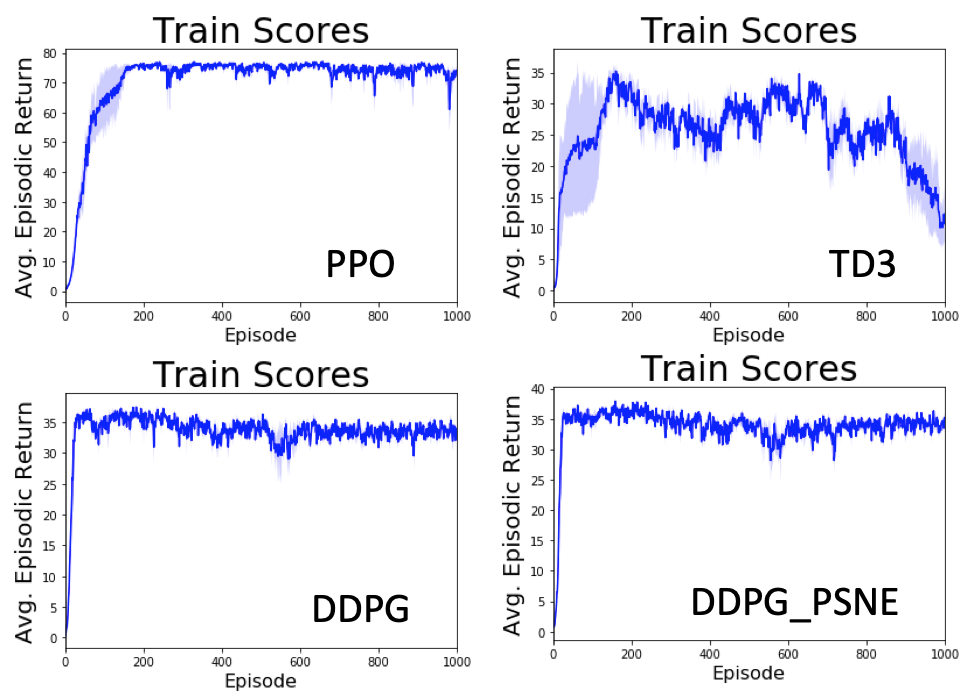

[actor-critic]: assets/actor-critic.png

[image1]: assets/reachers.gif
[image2]: assets/crawler.png
[discounted_state_visitation]: assets/discounted_state_visitation.png
[Reacher]: https://github.com/Unity-Technologies/ml-agents/blob/master/docs/Learning-Environment-Examples.md#reacher
[Crawler]: https://github.com/Unity-Technologies/ml-agents/blob/master/docs/Learning-Environment-Examples.md#crawler

[PPO]:   https://arxiv.org/pdf/1707.06347.pdf
[A3C]:   https://arxiv.org/pdf/1602.01783.pdf
[D4PG]: https://openreview.net/pdf?id=SyZipzbCb
[DQN]:  https://storage.googleapis.com/deepmind-media/dqn/DQNNaturePaper.pdf

[DPG]:  http://proceedings.mlr.press/v32/silver14.pdf
[DDPG]: https://arxiv.org/pdf/1509.02971.pdf
[PSNE]:  https://arxiv.org/pdf/1706.01905.pdf
[TD3]: https://arxiv.org/pdf/1802.09477.pdf

[karpathy_rl_blog]: http://karpathy.github.io/2016/05/31/rl/
[lilian_weng_policy_gradient]:https://lilianweng.github.io/lil-log/2018/04/08/policy-gradient-algorithms.html#policy-gradient
[Layer Normalization]: https://arxiv.org/abs/1607.06450
# Continuous Control
### Introduction

For this project, I explore the application of [DDPG], [DDPG] with parameter-space noise variation [PSNE], [TD3], and [PPO].

These application are applied to [Reacher] and [Crawler] environments. Two versions of [Reacher] are tried: one with a single agent, the other with multiple agents.

Algorithms such as [A3C] and [D4PG] (based on [DDPG]) take a distributed approach to environments with multiple agents. However, in this work I focus on [PPO], [TD3], [DDPG], and [DDPG] with parameter space noise [PSNE], with small adaptations for multi-agent environments.

### Environment Description

#### [Reacher]

In this environment, a double-jointed arm can move to target locations. A reward of +0.1 is provided for each step that the agent's hand is in the goal location. Thus, the goal of the agent is to maintain its position at the target location for as many time steps as possible.

The observation space consists of 33 variables corresponding to position, rotation, velocity, and angular velocities of the arm. Each action is a vector with four numbers, corresponding to torque applicable to two joints. Every entry in the action vector is a number between -1 and 1.
This is a *multi*-agent (20) where there are several identical agents each with its own copy of the environment

*Note:* The old report includes the single agent experiment as well. They are located onder 'notebooks/old'

##### Training Traces

PPO achieves the highest score on Reacher (approx 75), while the other ones are approx 35 score.

#### [Crawler]
The multi-agent (13) [Crawler] enviroment is used here.

### Scoring
The tasks in this project are episodic, that is, the agent/s run for a finite number of steps on the environment.
- After each episode, add up the rewards that each agent received (without discounting) to get a score for each agent.  This yields *N* (potentially different) scores.
- Take the average of these scores yielding an **average score** for each episode (where the average is over all the agents).

## Poicy gradient continuous control algorithms implemented

### Deep Deterministic Policy Gradients [DDPG]
[DDPG], [DDPG] + [PSNE] are implemented. The explanation for these algorithms is found
[here](ddpg.md)

### Twin Delayed Deep Deterministic Policy Gradient [TD3]
[TD3] is implemented. Explanation is [here](td3.md)

### Proximal Policy Optimization [PPO]
In this particular version, for policy gradient loss computation (and clipping), the PPO2 version found in OpenAI's baseline implementation (in Tensorflow) approach was used.
Theoretical explanatory material coming soon ...

### Networks
##### Deterministic Actor
(Used for DDPG and its variants, TD3) is a fully connected network with:
 - 3 hidden layers of 256,256,128 units
 - `ReLU` nonlinearities for the hidden layers
 - 1 output layer of with `tanh` activation
 - [Layer Normalization] used in hidden layers (helps with PSNE approach)
 - Input is batch normalized
Located in `agents/topologies/actor.py`

##### Stochastic Actor
Used for [PPO], it is a fully connected FF network which shares the latent features with the Gaussian distribution parameter estimation (i.e. mu), as well as the value function (Vf).
So, this is a two-headed network. The Gaussian head serves as the stochastic policy and Vf is further used for the advantage estimation.
*Latent feature body*:
- 2 hidden layers for the shared body of latent features. Each layer of 256 units
- `ReLU` non-linearity used for hidden feature layers
- [Layer Normalization] used between the hidden layers

*Gaussian head (i.e. policy)*:
- One fully connected layer
- `tanh` activation
- Sigma parameter is populated at runtime depending on the use: during training it is the annealed value, while at test-time a very small value (--> greedy).
- Parameters are used in a Gaussian distribution object which is then sampled accordingly

*Value function (VF) head*
- Fully connected layer
- Linear activation

Located in `agents/topologies/actor.py`

#### Dependencies
* python: 3.5
* tensorboardX: 1.4
* tensorboard: 1.7.0
* pytorch: 0.4.1
* numpy: 1.15.2
* Linux or OSX environment

##### Test the algorithms the actor
Run `test_ddpg_psne.py` with the following option:
* -a : algorithm of choice: `TD3|PPO|DDPG|DDPG_PSNE`

###### Pre-trained Models
Trained models are under:

`/models/<algorithm>`

###### Video
Coming way too soon ...
