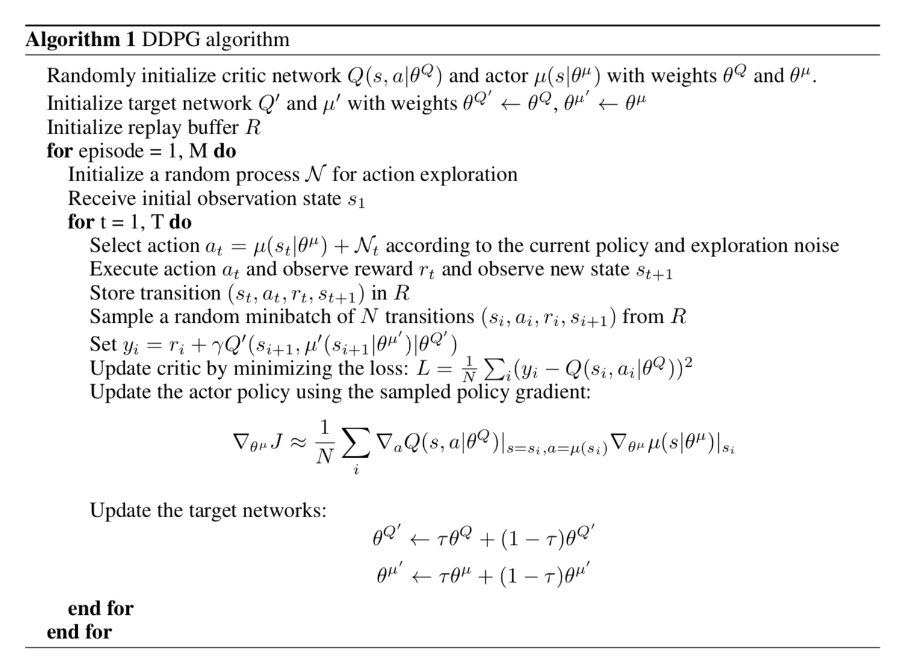

[actor-critic]: assets/actor-critic.png

[image1]: assets/reachers.gif
[image2]: assets/crawler.png
[discounted_state_visitation]: assets/discounted_state_visitation.png
[Reacher]: https://github.com/Unity-Technologies/ml-agents/blob/master/docs/Learning-Environment-Examples.md#reacher 
[Crawler]: https://github.com/Unity-Technologies/ml-agents/blob/master/docs/Learning-Environment-Examples.md#crawler
[DDPG_algo]: assets/DDPG_algo.png

[DPG]:  http://proceedings.mlr.press/v32/silver14.pdf
[DDPG]: https://arxiv.org/pdf/1509.02971.pdf
[PSNE]:  https://arxiv.org/pdf/1706.01905.pdf 

[PPO]:   https://arxiv.org/pdf/1707.06347.pdf
[A3C]:   https://arxiv.org/pdf/1602.01783.pdf
[D4PG]: https://openreview.net/pdf?id=SyZipzbCb
[DQN]:  https://storage.googleapis.com/deepmind-media/dqn/DQNNaturePaper.pdf

[karpathy_rl_blog]: http://karpathy.github.io/2016/05/31/rl/
[lilian_weng_policy_gradient]:https://lilianweng.github.io/lil-log/2018/04/08/policy-gradient-algorithms.html#policy-gradient

# Continuous Control
### Introduction

For this project, I explore the application of [DDPG], with parameter-space noise variation [PSNE]. A few variations of [PSNE] are tried to speed up training.
 
These application are applied to [Reacher] and [Crawler] environments. Two versions of [Reacher] are tried: one with a single agent, the other with multiple agents. 

Algorithms such as [A3C] and [D4PG] (based on [DDPG]) take a distributed approach to environments with multiple agents. However, in this work I focus on the combinations of [DDPG] and variations [PSNE], with small adaptations for multi-agent environments.

### Environment Description

#### Reacher

In this environment, a double-jointed arm can move to target locations. A reward of +0.1 is provided for each step that the agent's hand is in the goal location. Thus, the goal of the agent is to maintain its position at the target location for as many time steps as possible.

The observation space consists of 33 variables corresponding to position, rotation, velocity, and angular velocities of the arm. Each action is a vector with four numbers, corresponding to torque applicable to two joints. Every entry in the action vector is a number between -1 and 1.

#### Training variants

For this project, I explore two separate versions of the Unity environment for [Reacher]:
- The first version contains a *single* agent.
- The second version is a *multi*-agent where there are several identical agents each with its own copy of the environment: 
    - *Reacher* contains 20 agents
    - *Crawler* contains 13 agents

Only the multi-agent [Crawler] enviroment is used here. 

### Solving the Environments
The tasks in this project are episodic, that is, the agent/s run for a finite number of steps on the environment.
For purposes of Udacity's Deep RL class the following variations determine when an environment is solved: 

#### Option 1: Solve the single agent version
The task is episodic, and in order to solve the environment,  your agent must get an average score of +30 over 100 consecutive episodes.

#### Option 2: Solve the Second Version

The barrier for solving the second version of the environment is slightly different, to take into account the presence of many agents.  In particular, your agents must get an average score of +30 (over 100 consecutive episodes, and over all agents).  Specifically,
- After each episode, we add up the rewards that each agent received (without discounting), to get a score for each agent.  This yields 20 (potentially different) scores.  We then take the average of these 20 scores. 
- This yields an **average score** for each episode (where the average is over all 20 agents).

The environment is considered solved, when the average (over 100 episodes) of those average scores is at least +30. 

## Deep Deterministic Policy Gradients [DDPG]  for Continuous Control

For [DDPG], we use an actor-critic model and build on the insights gained from [DQN], which was able to achieve human level performance on Atari games, to tackle continuous control problems. While [DQN] handles complex high dimensional systems, it has a significant limitation as it operates on discrete action space. One, of course, can approach a continuous control problem by discretizing the action (i.e. control) space at the cost of the loss of precision (quantization errors), and more importantly, for multiple control dimensions problems, face an explosion in the number of discrete outputs, making learning very difficult or intractable.

### Background

This subsection draws heavily from [this excellent article][lilian_weng_policy_gradient]

The goal in reinforcement learning is to learn a policy which maximizes the expected return from the _start_ distribution:

`J(θ) = E[G0|s0, a~π(s|θ) r,s~env] =`

`∑{s,s0}∈𝒮(d(s|s0,θ)V(s0|θ)) = `

`∑{s,s0}∈𝒮(d(s|s0, θ)∑{a}∈𝒜(π(a|s, θ)Q(s,a|θ))`

where `V(s|θ)` denotes the value function if the parametrized policy `π(·|·, θ)` is followed. `d(s|s0, θ)` is the stationary state distribution of the underlying Markov process defined as `d(s|s0,θ) = lim(t->∞)P(S = st|S = s0, θ)`.

The stationary distribution denotes the probability distribution after the model takes an infinite number of states and follows the policy. So, it's values depend on the policy (known via θ), and on the environment (unknown).

Since we're trying to _maximize_ our objective function, we follow the direction of the gradient `∇J(θ)`, to perform _gradient ascent_ in order to find its maximum value.

The formulation of the objective function as the sum and product of known and unknown functions whose input is θ, we need to know their derivatives w.r.t to θ. in order to compute ∇J(θ). While that is known for a policy, we cannot take the derivative the the state distribution. Alternatively, how  can we know the direction of change a change in policy causes on the distribution of the unknown environment ?

##### Policy Gradient Theorem
According to the _policy gradient theorem_, we have:

`∇J(θ) = ∇(∑{s,s0}∈𝒮(d(s|s0,θ)∑{a}∈𝒜(π(a|s,θ)Q(s,a|θ)))`

thus:

`∇J(θ)∝ ∑{s,s0}∈𝒮(d(s|s0, θ)∑{a}∈𝒜(∇π(a|s,θ)Q(s,a|θ))`

where the `∇` are always with respect to `θ`. As we can see, the gradient of the objective function does not involve the gradient of the stationary state distribution, `d`, as mentioned earlier, we couldn't compute the effects a change in `θ` would have (i.e. we don't know how to compare two policies and their affect the state distributions). Therefore, all that is required for the computation of the gradient of the objective function, is that for each sample obtained from the distributions - `d` and `π` we obtain the gradient of the policy. The theorem guarantees that the expectation of the gradients of the samples will be proportional to the gradient of the objective function itself.

##### Deterministic Policy Gradient (DPG)
Let the probability of _k_-step state visitations, starting from `s0` to `s`, following a policy `𝜋` be denoted as:

`𝜌(s0 -> s, k)`

where:

`𝜌(s -> s, 0) = 1`

`𝜌(s0 -> s', 1) = 𝛴{a}p(s'|s,a)𝜋(a|s)`

`𝜌(s0 -> s', k+1) = 𝛴{s*}𝜌(s0 -> s*, k)𝛴{a}p(s'|s*,a)𝜋(a|s*) = 𝛴{s*}𝜌(s0 -> s*, k)𝜌(s* -> s', 1)`

So the state visitation probability denotes the probability of all possible routes from `s0` to `s` in the MDP graph.

With this interpretation, the stationary distribution `d(s|s0)` above can also be written as:

`d(s | s0) = 𝛴{k: 0 -> ∞}𝜌(s0 -> s, k) / 𝛴{{s0, s*}∈𝒮, k: 0 -> ∞}𝜌(s0 -> s, k)`

So far, the policy function `π(.|s)` is always modeled as a probability distribution over actions given the current state and thus it is _stochastic_. Deterministic policy gradient (DPG) instead models the policy as a deterministic decision: `a=μ(s)`

Let:

`𝜌0(s)`: initial distribution over states
`𝜌(s)`: discounted state visitation distribution under the _deterministic_ policy `μ`:

The objective function under this framework is defined as:

`J(θ)=∫ρ(s)Q(s,μ(s;θ))ds`

where the stochastic sources are the state visitations, not the actions. The gradient of this objective function is:

`∇J(θ) = E[∇Q(s,μ(s;θ)∇μ(s;θ) | ρ(s)]`, again, all the gradients are with respect to the parameters of the policy.

The deterministic policy is a special case of the stochastic policy. Stochastic policy `μ` can be re-parametrized by a deterministic policy and a variational term `𝜎`. Compared to the deterministic policy, we expect the stochastic policy to require more samples as it integrates the data over the whole state and action space

#### DDPG

As mentioned above, DDPG combines DPG and DQN.  The original DQN works in discrete space, and DDPG extends it to continuous space with the actor-critic framework while learning a deterministic policy.

##### Actor - Critic

Under the actor(`μ` - deterministic/`π` - stochastic) + critic(`Q`/`V`) framework, the critic evaluates the expectations of returns for a given state. Its knowledge is used for optimizing the next action (i.e. the actor). The actor, in turn explores and assists in improving the critics values (a bootstrap approach).

##### Deep Q Network (DQN)
[DQN] is able to learn value functions using function approximators in a stable and robust way due to two innovations:

1. a _behavioral_ network is trained off-policy with samples from a replay buffer to minimize correlations between samples
2. this network is trained with a _target_ Q network to give consistent targets during temporal difference backups. In return, the _target_ network is slowly updated with the weights of the _behavioral_ network

#### Algorithm
[DDPG] takes a similar approach to DQN, in that it uses a behavioral and a target network type for each of the actor and critic. The behavioral actor uses the gradient of the behavioral critic to compute the objective function's gradient.
The behavioral critic minimizes the TD(0) error between its estimations and target estimations derived from the target critic. However, unlike in DQN, in DDPG the target networks are very slowly updated every episodic iteration (via the `𝜏` hyper-parameter)

where the `'` denote the _targets_.

But since we're using a deterministic policy, exploration is achieved by sampling from a noise process. Following the authors, the Ornstein-Uhlenbeck process was used, for the vanilla implementation of DDPG

#### Parameter Noise Space for Exploration
An alternative approach to finding optimal solutions to RL problems are evolutionary methods. In these methods, the search is performed in parameter space. Analogously, in [PSNE] the authors perturb the parameters of the Actor at the beginning of the episode.

Adding action space noise, while in a fixed state, by definition, we obtain different actions when encountering the same space during the rollout. By perturbing the actor parameters once per episode, we obtain repeatable actions for each state encountered (during the episode). This ensures consistency in actions, and directly introduces a dependence
between the state and the exploratory action taken.

However, perturbing deep NN is not straightforward, as the effects of noise would vary by layer. By using _layer normalization_, the same noise scale can be used across layers, even if different layers varying sensitivities to noise.

##### Adaptive noise scaling
In order to pick a consistent noise scale `σ` across different topologies, and over the training process (as the network becomes more sensitive as learning progresses), the following formulation is used:

where `d()` denotes the distance in the actions produced between a policy and it's perturbed version:

The distance metric is estimated on a batch sampled on the replay memory.

In this approach, the exploratory actions are taken by the _perturbed_ actor, while the rest of the learning algorithm remains the same.

#### Number of agents
These aproaches were tried with single and multiple agent environments. A radical speedup, in terms of epoch count, was noticed in solving the environment.

Using DDPG + PSNE, the single agent reacher environment was solved (score +30 over 100 consecutive episodes) in 493 episodes, while the multi agent environment was solved in 131 episodes.

#### Dependencies
* python: 3.5
* tensorboardX: 1.4
* tensorboard: 1.7.0
* pytorch: 0.4.1
* numpy: 1.15.2
* Linux or OSX environment

##### Train the agent:
Run `train_ddpg_psne.py` with the following options:
* a : agents being used (single / multi)
* e : number of episodes
* f : folder name for saving models and tensorboard under

##### Test the actor
Run `test_ddpg_psne.py` with the following option:
* p : path of actor network

###### Pre-trained Models
The multi-agent environment pre-trained model is located under
`/models/local_actor.pth`

A sample video of the running actor is located in `/assets/Reacher_DDPG_PSNE.mp4`

