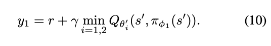
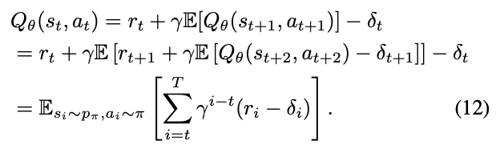
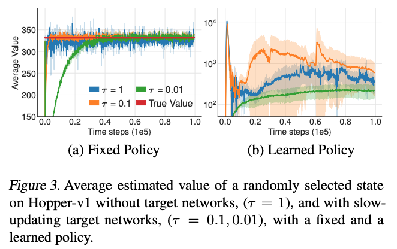
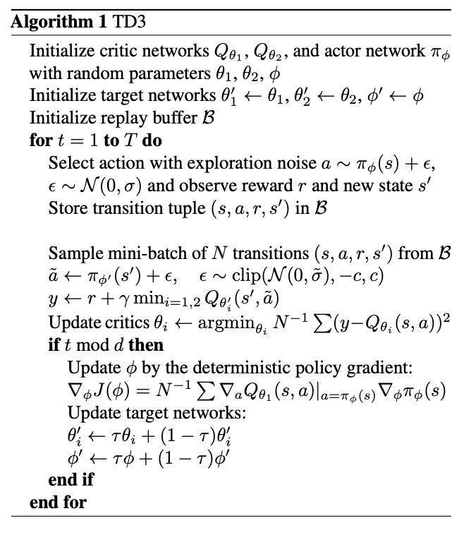

[DDPG]: https://arxiv.org/pdf/1509.02971.pdf
[TD3]: https://arxiv.org/pdf/1802.09477.pdf

[Double DQN]: https://arxiv.org/pdf/1509.06461.pdf

# [TD3], adressing function approximation error in AC methods

Function approximation errors are lead to overestimated value estimates and suboptimal policies. This problem is also present actor-critic settings.
The authors, building on [Double DQN], and propose a few methods to minimize its effects on both the actor and the critic [here](https://arxiv.org/pdf/1802.09477.pdf).

### Issues addressed

#### Clipped Double Q-Learning for Actor-Critic
In attempting to address overestimation bias, authors start off by extending the concept of Double Deep Q-Learning, in which, the greedy update is disentangled from the value function by maintaining two separate value estimates, each of which is used to update the other.
The hope is that if the value estimates are independent, they can be used to make unbiased estimates of the actions selected using the opposite value estimate. In the Actor-Critic setting the update uses the current policy rather than the target policy in the learning target value. So here, we use an unbiased estimate of the next best action using current policy, while we greedily update the current policy using the value estimate from the target value function.

However the authors found that this achieved little in reducing overestimation bias. The current and target networks were too similar to make independent estimations.

The authors propose using a pair of actors and critics to achieve independent estimations. Under this setting, the opposite policy is used for the target estimate of this policy, for example, target `y1 = r + Q1(s', π2(s'))` is used in the update of `Q1`
But this is still biased because the networks sample the same replay buffer and the policies will indirectly affect each other, since each policy is optimized wrt the value function updated by the opposite policy. So pretty much, you can think of this as a closed-loop leak of influence.

Moreover, for some states, this dependence will exacerbate, i.e. : `Q1(s, π2(s)) >= Q2(s, π2(s))`, when we think that `Q2(s, π2(s))` suffers from overestimation.
To address this problem, we propose to simply upper-bound the less biased value estimate `Q2` by the biased estimate `Q1`.  This results in taking the minimum between the two estimates, to give the target update of our Clipped Double Q-learning algorithm.

#### Error Accumulation
Due to the temporal difference update, where an estimate of the value function is built from an estimate of a subsequent state, *there is a build up of error*.
These estimation errors can accumulate, resulting in large overestimation bias, which in turn lead to suboptimal policy updates.

This means that the Bellman equation is never satisfied, and ultimately, the value function that is learned includes this error.

#### Target Networks and Delayed Policy Updates

Target networks achieve stability in deep RL.  Since deep function approximators require multiple gradient updates to converge, target networks provide a stable objective in learning and allow a greater coverage of the training data.

Without a fixed target, each update leaves some residual error which will begin to accumulate (see above).
When paired with a policy maximizing over the value estimate, it can result in wildly divergent values.

*The following is my interpretation of the graph, as I think the authors could have done a better job in their explanation*

* **Fixed policy case**:  The *true* value is estimated using the actual discounted return over 1000 episodes following some fixed the behavioral policy, starting from some *fixed* state. While the behavioral network continues to learn, the *estimated* values are plotted above.
* **Learned policy case**: The average estimations of the continuously learning behavioral policy which is also used as the policy.

While updating the value estimate without target networks (τ = 1) increases the volatility, all update rates result in similar convergent behaviors when considering a *fixed* policy.
However, when the policy is trained with the current value estimate, the use of fast-updating target networks results in highly divergent behavior.

Takeaways:
* Divergence that occurs without target networks is the result of *policy updates* with a *high variance value* estimate.
* Failure is related to the *interplay between the actor and critic updates*. Value estimates diverge through overestimation when the policy is poor (**error accumulation**), and the policy will become poor if the value estimate itself is inaccurate (optimizing for the **wrong expected values**).

Based on these insights, the authors propose *delaying the update of the policy* until the error in estimation has subsided. This is achieved by updating the policy every *d* steps per critic update.

#### Target Policy Smoothing Regularization
Deterministic policies can overfit to narrow peaks in the value estimate (refer to policy gradient theorem).
When updating the critic, a learning target using a deterministic policy is highly susceptible to inaccuracies induced by function approximation error, increasing the variance of the target.
This induced variance can be reduced through regularization, which the authors achieve via *target policy* smoothing. This is achieved by adding gaussian noise to the next step action generated by the target policy.
This has the effect of fitting the value of a small area around the target action.  This would have the benefit of smoothing the value estimate by bootstrapping off of similar state-action value estimates. The added noise is clipped to keep the target close to the original action.

#### [TD3]

The authors address all the above issues in the [TD3] algorithm, which pretty much can be viewed as a modified version of [DDPG], while addressing the 3 main issues above.

